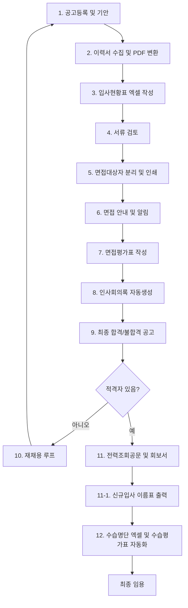

# 구로센터 채용 및 수습 관리 자동화 워크플로우

본 문서는 `guro_recruitment-calendar-app` 채용달력 관리 웹앱을 기준으로, 채용 공고부터 최종 합격 이후 수습 관리까지의 업무 흐름을 정리한 마스터 워크플로우입니다.

현재 앱은 GitHub Pages 기반 정적 웹앱이므로, 브라우저 안에서 처리 가능한 기능과 서버, 외부 API, 한글/엑셀 자동화 도구가 필요한 기능을 구분하여 단계별로 구현합니다.

## 전체 파이프라인



## 구현 구분

| 구분 | 현재 정적 웹앱에서 가능 | 서버/외부 도구 필요 |
|---|---|---|
| 채용공고 등록 | 가능 | 선택 |
| 자동 채용일정 생성 | 가능 | 불필요 |
| HWPX 공고 생성 | 가능 | 고급 서식 검증은 도구 필요 |
| TXT 공고 생성 | 가능 | 불필요 |
| 면접대상자 관리 | 가능 | 불필요 |
| 인사회의록 HWPX 생성 | 가능 | 양식 복잡도에 따라 도구 필요 |
| 이력서 HWP/PDF 변환 | 제한적 | 필요 |
| 입사현황표 엑셀 누적 | 브라우저 다운로드 방식 가능 | 파일 직접 누적은 필요 |
| SMS/이메일 발송 | 불가 | 필요 |
| 구글 캘린더 연동 | 불가 | 필요 |
| 수습명단 엑셀 자동 갱신 | 다운로드 방식 가능 | 원본 파일 직접 갱신은 필요 |
| 수습평가표 HWPX 생성 | 가능 | 양식 검증 필요 |
| 전력조회공문 HWTX/HWPX 생성 | 가능 | 양식 검증 필요 |
| 신규입사 인사카드 이름표 생성 | 가능 | 양식 검증 필요 |
| 신규입사 책상 이름표 생성 | 가능 | 양식 검증 필요 |

## 1. 채용공고 등록 및 달력 연동

업무 내용:
- 채용달력 관리 웹앱에서 새 채용 공고를 등록합니다.
- 공고 유형, 시행번호, 접수일, 채용부서, 채용인원, 직무내용을 입력합니다.

자동화 규칙:
- 긴급 공고는 공고일 포함 8일 기준으로 접수기간을 생성합니다.
- 일반 공고는 공고일 포함 16일 기준으로 접수기간을 생성합니다.
- 접수기간 중 평일 공휴일이 포함되면 접수 마감일을 자동 연장합니다.
- 서류심사일은 서류마감 다음날로 자동 생성합니다.
- 면접 예정일은 서류심사 다음날로 자동 생성합니다.
- 면접 확정일이 입력되면 예정일과 구분하여 표시합니다.
- 공고, 서류마감, 서류심사, 면접, 채용시작 일정은 달력에 자동 표시합니다.

매핑 데이터:
- 공고제목
- 시행번호
- 채용부서
- 채용분야
- 채용인원
- 담당업무
- 자격요건
- 접수기간
- 면접일
- 근무개시일

## 2. 이력서 접수 및 PDF 단일화

업무 내용:
- 사람인, 이메일, 고용24 등 외부 채널로 접수된 지원자 서류를 취합합니다.

자동화 방향:
- HWP/HWPX/DOCX/PDF 등 다양한 제출 파일을 지원자별 폴더에 정리합니다.
- HWP/HWPX 파일은 PDF로 변환하여 통합 보관합니다.
- 변환된 파일명은 `지원자명_지원분야.pdf` 형식을 사용합니다.

주의:
- 이 단계는 브라우저 정적 웹앱만으로는 안정적으로 처리하기 어렵습니다.
- 로컬 Python/Node 스크립트 또는 별도 서버 자동화가 필요합니다.

## 3. 입사현황표 엑셀 자동 작성 및 출력

업무 내용:
- 서류 마감 후 전체 지원자 명부를 내부 보고용으로 정리합니다.

자동화 방향:
- 지원자명, 주소, 휴대폰, 이메일, 장애 유무, 졸업학교, 주요 경력, 지원분야, 입사지원일을 추출합니다.
- `입사현황표.xlsx` 양식에 행 단위로 누적합니다.
- 웹앱에서는 CSV/XLSX 다운로드 방식으로 우선 구현합니다.

매핑 데이터:
- 지원자 성명
- 주소
- 휴대폰
- 이메일
- 장애 유무
- 졸업학교
- 학력 사항
- 주요 경력 내용
- 지원분야
- 입사지원일

## 4. 부서 팀장 서류 검토

업무 내용:
- 채용부서 담당 팀장이 서류를 검토합니다.

자동화 방향:
- 채용건별 지원자 목록을 별도 화면에서 확인합니다.
- 지원자 상태를 `서류접수`, `서류심사`, `면접대기`, `불합격` 등으로 변경합니다.
- 팀장 의견, 심사 결과, 면접 추천 여부를 기록합니다.

## 5. 면접 대상자 분류 및 심사세트 인쇄

업무 내용:
- 서류 합격자를 면접 대상자로 분류합니다.

자동화 방향:
- 서류 합격자만 면접 대상자 목록에 표시합니다.
- 면접 대상자 이름, 연락처, 면접시간, 상태를 관리합니다.
- 면접 대상자별 출력용 문서 세트를 다운로드할 수 있도록 합니다.

## 6. 면접 안내 및 발송 자동화

업무 내용:
- 면접 대상자에게 면접 일정과 준비사항을 안내합니다.

현재 웹앱에서 가능한 기능:
- 선택일 상세 화면에서 면접 일정, 대상자 이름, 연락처를 복사합니다.
- 문자/이메일 발송 전에 안내문 초안을 만들 수 있습니다.

외부 연동 필요 기능:
- SMS
- 알림톡
- 이메일 자동 발송
- 구글 캘린더 초대

매핑 데이터:
- 수신자 번호
- 지원자명
- 면접일시
- 면접장소
- 준비사항

## 7. 면접평가표 작성

업무 내용:
- 면접위원이 지원자별 면접평가표를 작성합니다.

자동화 방향:
- 면접 일정 기준으로 평가표 양식을 준비합니다.
- 지원자별 HWPX 평가표를 업로드하거나 생성합니다.
- 평가표가 없는 지원자는 `면접 당일 불참`으로 처리합니다.

문구 규칙:
- `지원자 000은 면접 당일에 불참하였다.`

## 8. 인사위원회 회의록 자동 생성

업무 내용:
- 면접 종료 후 인사위원회 회의록을 작성합니다.

자동화 규칙:
- 한 채용건에서 면접자가 여러 명이면 면접평가표 여러 개를 첨부합니다.
- 결과물은 인사회의록 1개로 생성합니다.
- 평가표가 있는 지원자는 참석자로 처리합니다.
- 평가표가 없는 지원자는 불참자로 처리합니다.
- 채용자가 없으면 `채용자 없음` 및 재공고 진행 내용을 기록합니다.

매핑 데이터:
- 회의 일시
- 채용건명
- 채용부서
- 면접대상자
- 참석자
- 불참자
- 최종 채용자
- 의결 내용

## 9. 최종합격 발표 및 통보

업무 내용:
- 최종합격자 또는 적격자 없음 결과를 공고합니다.

자동화 방향:
- 최종합격 공고문 TXT 초안을 생성합니다.
- 홈페이지 게시용 특수문자 최소화 텍스트를 생성합니다.
- 합격자와 불합격자 안내문 템플릿을 분리합니다.

## 10. 재채용 예외 루프

업무 내용:
- 적격자 없음, 채용 포기, 재공고 필요 시 기존 공고를 바탕으로 다시 진행합니다.

자동화 규칙:
- 기존 채용공고를 선택합니다.
- 새 시행번호와 접수일자를 입력합니다.
- 채용일정을 다시 계산합니다.
- 재공고 HWPX/TXT 문서를 생성합니다.
- 새 채용 일정으로 달력에 등록합니다.

## 11. 전력조회공문 및 전력조회회보서 작성

업무 내용:
- 합격자의 경력 확인과 호봉 산정을 위한 문서를 작성합니다.
- 채용완료자를 선택한 뒤, 필요할 때 수동으로 전력조회 공문을 생성합니다.

자동화 방향:
- 채용완료자 목록에서 대상자를 선택합니다.
- 합격자 정보와 전 직장 정보를 입력하거나 보완합니다.
- `전력조회공문 생성` 버튼을 눌러 요청 공문을 수동 생성합니다.
- 공문 시행번호, 수신처, 합격자 성명, 생년월일, 조회 대상 기관명, 경력 기간, 담당 직무를 양식에 반영합니다.
- 생성 파일은 `전력조회_성명_시행번호.hwpx` 또는 `전력조회_성명_시행번호.hwtx` 형식으로 저장합니다.

운영 규칙:
- 전력조회는 자동 실행하지 않고, 인사담당자가 채용완료자 정보를 확인한 뒤 수동으로 생성합니다.
- 수신처와 경력조회 대상 기관은 채용공고 정보만으로 확정하기 어려우므로 생성 전 입력 확인 단계를 둡니다.
- 생성 후 문서 손상 여부를 확인하고, 생성 폴더와 파일을 열어 검토합니다.

매핑 데이터:
- 합격자 성명
- 생년월일
- 공문 시행번호
- 수신처
- 조회 대상 기관명
- 경력 기간
- 담당 직무
- 입사예정일
- 채용부서

사용 양식:
- `[샘플][공문] GR2026-045  구로장애인자립생활센터 종사자 전력조회 요청(강지나).hwtx`

## 11-1. 신규입사 인사카드 이름표 및 책상 이름표 출력

업무 내용:
- 채용합격자 성함이 확정되면 인사카드용 이름표와 책상 이름표를 자동 생성합니다.
- 신규 입사자가 여러 명이면 합격자별로 각각 생성합니다.

자동화 방향:
- 채용완료자 목록에서 합격자를 선택합니다.
- `입사 출력물 생성` 버튼을 누르면 이름표 양식에 합격자 정보를 매핑합니다.
- 인사카드 이름표와 책상 이름표를 한 파일 안에 함께 생성합니다.
- 생성 파일명은 `신규입사_이름표_성명.hwpx` 형식으로 저장합니다.
- 생성 후 파일 손상 여부를 확인하고, 생성 폴더와 파일을 열어 바로 출력 가능하도록 합니다.

자동 생성 조건:
- 지원자 상태가 `채용` 또는 `최종합격`입니다.
- 합격자 성명이 입력되어 있습니다.
- 입사일이 있으면 함께 반영합니다.
- 부서, 직무, 직급이 있으면 이름표 보조 정보로 반영합니다.

매핑 데이터:
- 합격자 성명
- 채용부서
- 직무
- 직급
- 입사예정일
- 공고명
- 시행번호

사용 양식:
- `신규입사 이름표(인사카드및 책상).hwpx`

화면 구성:
- 위치: `문서 생성 > 채용완료자 출력물`
- 대상 선택: 채용완료자 목록에서 선택
- 입력 보완: 성명, 부서, 직급, 입사일, 시행번호
- 버튼 1: `인사카드/책상 이름표 생성`
- 버튼 2: `전력조회공문 생성`
- 버튼 3: `출력 폴더 열기`

## 12. 수습 관리 파이프라인

업무 내용:
- 신규 입사자의 수습기간을 관리하고 정식 임용 전 평가를 준비합니다.

자동화 규칙:
- 최종합격자 상태가 확정되고 입사일이 입력되면 수습 관리 대상으로 등록합니다.
- 입사일 기준 3개월 뒤를 수습만료예정일로 계산합니다.
- 수습만료예정일 30일 전을 평가작성 리마인더 날짜로 계산합니다.
- 달력에 `[수습평가 D-30] 부서명 성명 수습사원 평가작성 기간` 일정을 등록합니다.
- `수습기간_목록표_명단.xlsx`에 누적할 데이터를 생성합니다.
- `수습평가표.hwpx` 양식에 성명, 부서, 직급, 입사일, 수습기간을 반영합니다.

매핑 데이터:
- 부서명
- 직급
- 사원성명
- 사번
- 입사일자
- 수습기간 시작일
- 수습기간 종료일
- 평가예정일

## 개발 우선순위

### 1순위: 현재 정적 웹앱에서 바로 구현

- 채용건별 최종합격자 상태 관리
- 입사일 입력란 추가
- 수습만료예정일 자동 계산
- 수습 D-30 평가작성 일정 달력 표시
- 수습 대상자 목록 화면 추가
- 수습평가표 HWPX 생성 화면 추가
- 채용완료자 출력물 화면 추가
- 인사카드 이름표/책상 이름표 HWPX 생성
- 전력조회공문 수동 생성

### 2순위: 파일 다운로드 방식 자동화

- 수습명단 XLSX 다운로드
- 수습평가표 HWPX 다운로드
- 최종합격/불합격 공고 TXT 다운로드
- 전력조회회보서 HWPX 다운로드
- 전력조회공문 HWTX/HWPX 다운로드
- 신규입사 인사카드 이름표 HWPX 다운로드
- 신규입사 책상 이름표 HWPX 다운로드

### 3순위: 서버 또는 로컬 자동화 필요

- 원본 엑셀 파일 직접 누적 저장
- HWP/HWPX 이력서 PDF 변환
- PDF 내용 자동 파싱
- SMS/알림톡/이메일 발송
- 구글 캘린더 API 등록

## Codex 개발 프롬프트 A: 수습기간 목록표 및 수습평가표 자동화

```text
구로센터 채용달력 웹앱(guro_recruitment-calendar-app)에 수습 관리 기능을 추가해줘.

요구사항:
1. 지원자 상태가 최종합격 또는 채용으로 변경되고 입사일자가 입력되면 수습 관리 대상으로 등록한다.
2. 입사일 기준 3개월 뒤를 수습만료예정일로 자동 계산한다.
3. 수습만료예정일 30일 전을 평가작성 리마인더 날짜로 계산한다.
4. 달력에 [수습평가 D-30] 부서명 성명 수습사원 평가작성 기간 일정을 표시한다.
5. 수습관리 목록 화면을 만들고 이름, 부서, 직급, 입사일, 수습만료예정일, 평가예정일을 보여준다.
6. 수습기간_목록표_명단.xlsx 다운로드 기능을 만든다.
7. 수습평가표_양식.hwpx 파일을 기반으로 성명, 부서, 입사일, 수습기간을 반영한 수습평가표_성명.hwpx 파일을 생성한다.
8. 기존 채용공고, 면접, 인사회의록, 공고문 생성 기능은 깨지지 않게 유지한다.
```

## Codex 개발 프롬프트 B: 채용완료자 출력물 및 전력조회공문 생성

```text
구로센터 채용달력 웹앱(guro_recruitment-calendar-app)에 채용완료자 출력물 생성 기능을 추가해줘.

요구사항:
1. 채용 목록에서 상태가 채용 또는 최종합격인 사람만 채용완료자 출력물 대상자로 표시한다.
2. 대상자를 선택하면 성명, 부서, 직급, 직무, 입사예정일, 시행번호를 자동으로 불러온다.
3. 신규입사 이름표(인사카드및 책상).hwpx 양식을 기반으로 인사카드 이름표와 책상 이름표가 포함된 신규입사_이름표_성명.hwpx 파일을 생성한다.
4. 전력조회공문은 자동 생성하지 않고, 담당자가 대상자와 수신처, 조회 기관, 경력 기간을 확인한 뒤 전력조회공문 생성 버튼을 눌렀을 때만 생성한다.
5. [샘플][공문] GR2026-045 구로장애인자립생활센터 종사자 전력조회 요청(강지나).hwtx 양식을 기반으로 전력조회_성명_시행번호.hwtx 또는 .hwpx 파일을 생성한다.
6. 문서 생성 후 파일 손상 여부를 확인하고, 생성 폴더와 파일을 열어 바로 검토할 수 있게 한다.
7. 기존 공고파일 생성, 인사회의록 생성, 수습관리 기능은 깨지지 않게 유지한다.
```

## Codex 개발 프롬프트 C: 공고기안 및 입사현황표 자동화

```text
채용 웹앱에 공고기안 생성과 입사현황표 엑셀 누적 기능을 추가해줘.

요구사항:
1. 웹앱에서 채용공고 폼 데이터를 입력하면 공고기안_양식.hwpx에 데이터를 매핑해 새 파일로 다운로드한다.
2. 공고일, 접수기간, 서류심사일, 면접예정일을 자동 계산한다.
3. 지원자 정보를 입력하거나 CSV로 가져오면 입사현황표.xlsx 형식으로 다운로드한다.
4. 지원자명, 주소, 휴대폰, 이메일, 장애 유무, 졸업학교, 지원분야, 주요경력, 입사지원일, 서류심사 결과를 행 단위로 정리한다.
5. GitHub Pages 정적 웹앱에서 동작 가능한 방식으로 우선 구현한다.
6. HWP/PDF 변환, SMS 발송, 구글 캘린더 API는 별도 서버 연동 예정 기능으로 분리한다.
```
